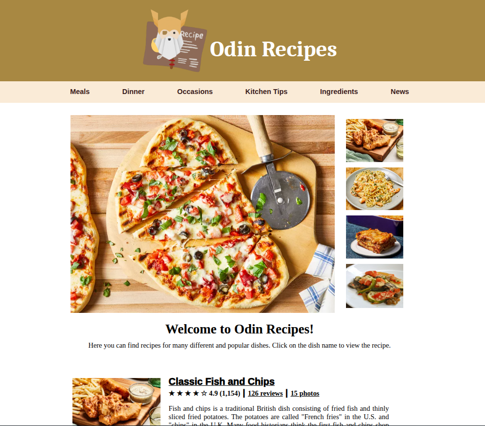
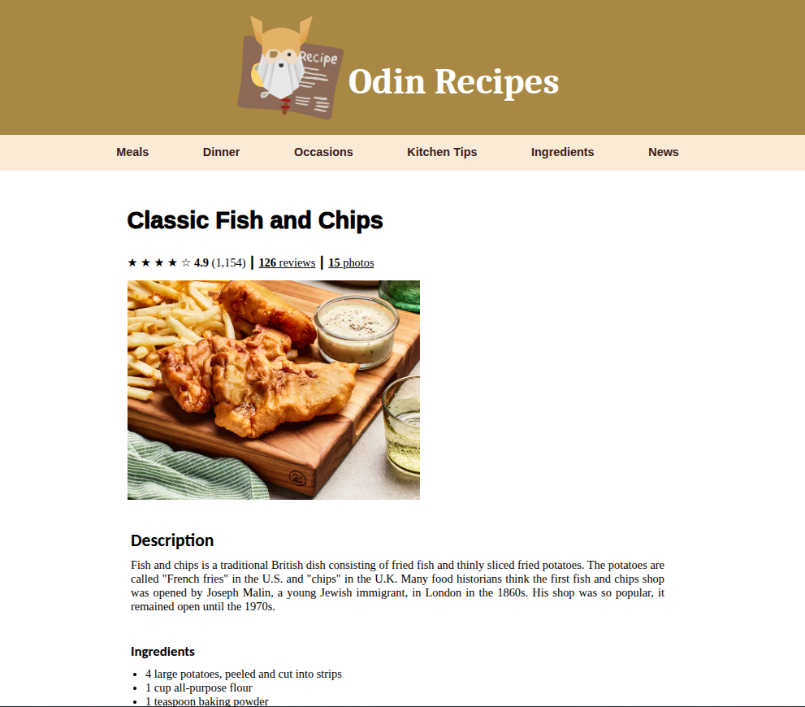

# Odin Recipes

## Description

HTML + CSS project (basic CSS, without flexbox or grid).

It's a basic recipe website. It consists of a main index page which have links to a few recipes.

This was my first project using HTML and CSS. Many of the buttons on the website are just decorative, since the intention of the project was to learn the initial fundamentals of building a web interface.

## Live Demo

**[Click here](https://pedroasb.github.io/odin-foundations/odin-recipes/)** to try out this project on browser.

## Screenshots

